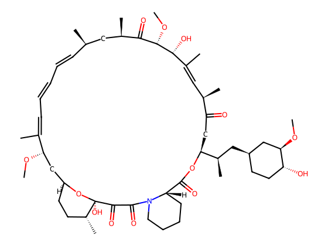
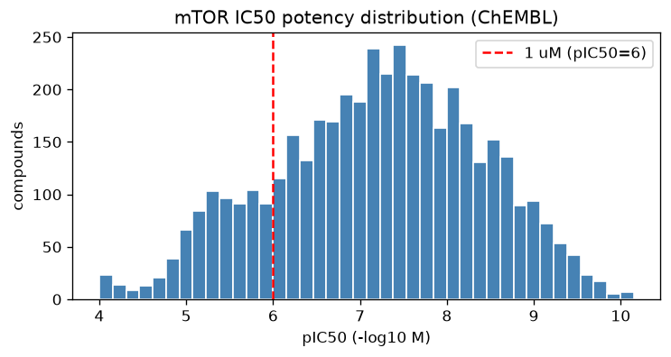
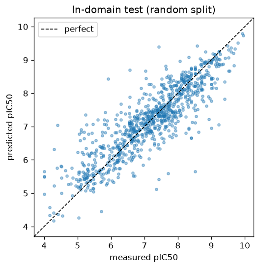
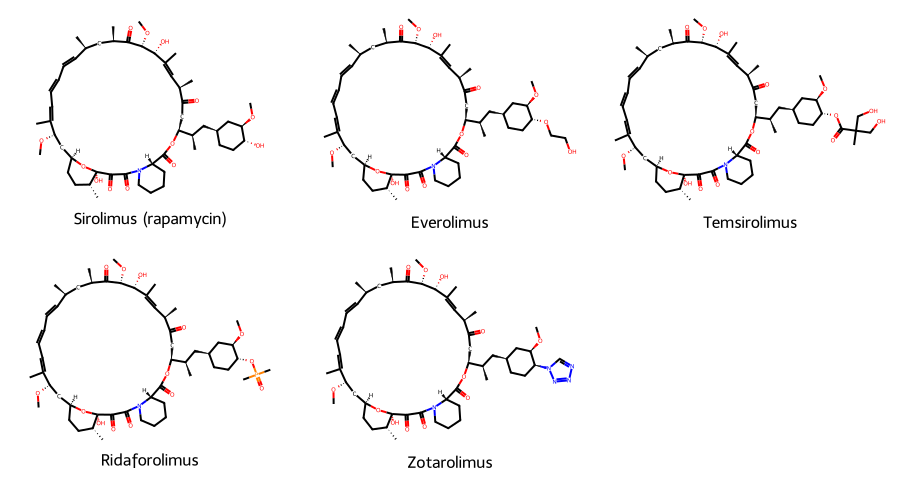
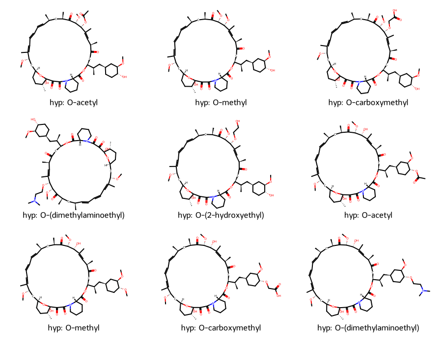
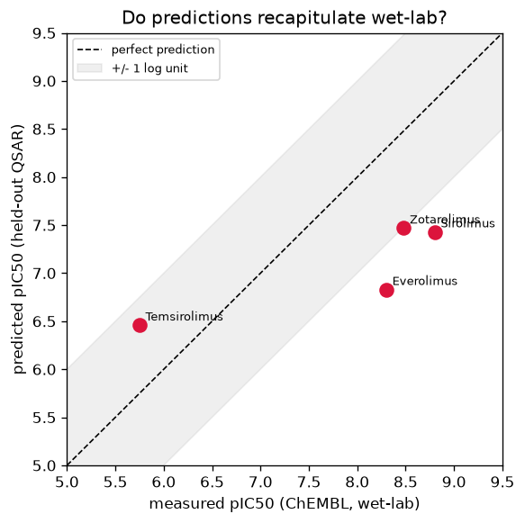

# Saved results — rapamycin_qsar.ipynb

Regenerated by running the notebook. Images and tables below survive `nbstripout`.

## Figures

### step1_rapamycin_structure.png



### step2_potency_distribution.png



### step2_indomain_scatter.png



### step3_real_rapalogs.png



### step3_hypothetical_analogs.png



### step4_recapitulation_plot.png



## Text / tables

### step1_descriptors.txt

```
Physicochemical descriptors of rapamycin:
  MolWt            914.19
  LogP               6.18
  HBD                3.00
  HBA               13.00
  TPSA             195.43
  RotatableBonds     6.00
  Rings              4.00
  HeavyAtoms        65.00

Lipinski Rule-of-5 violations: 3 -> {'MolWt>500': True, 'LogP>5': True, 'HBA>10': True}
```

### step1_fingerprint.txt

```
Morgan/ECFP4 fingerprint: 2048 bits, 100 of them 'on'.
first 60 bits: 010000110000000000000000000001000000000000100000000001000000
```

### step2_curation_summary.txt

```
raw mTOR IC50 rows: 5025
unique compounds after curation: 4350

pIC50 summary:
count    4350.00
mean        7.20
std         1.20
min         4.00
25%         6.38
50%         7.26
75%         8.07
max        10.15
```

### step2_model_metrics.txt

```
training compounds (rapalogs excluded): 4346
held-out test:  R2 = 0.745   MAE = 0.44 log units
```

### step4_recapitulation.csv

```
analog,type,pred_pIC50,measured_pIC50,error,AD_maxTanimoto
Sirolimus (rapamycin),real rapalog,7.43,8.8,-1.37,0.85
Everolimus,real rapalog,6.83,8.3,-1.47,0.84
Temsirolimus,real rapalog,6.46,5.75,0.71,0.92
Ridaforolimus,real rapalog,6.87,,,0.84
Zotarolimus,real rapalog,7.47,8.48,-1.01,0.86
```

### step4_hypothetical_predictions.csv

```
analog,type,pred_pIC50,measured_pIC50,error,AD_maxTanimoto
hyp: O-acetyl,hypothetical,6.65,,,0.8
hyp: O-methyl,hypothetical,6.66,,,0.8
hyp: O-carboxymethyl,hypothetical,6.66,,,0.77
hyp: O-(dimethylaminoethyl),hypothetical,6.6,,,0.77
hyp: O-(2-hydroxyethyl),hypothetical,6.66,,,0.76
hyp: O-acetyl,hypothetical,6.82,,,0.89
hyp: O-methyl,hypothetical,6.88,,,0.89
hyp: O-carboxymethyl,hypothetical,6.86,,,0.85
hyp: O-(dimethylaminoethyl),hypothetical,6.88,,,0.85
```
